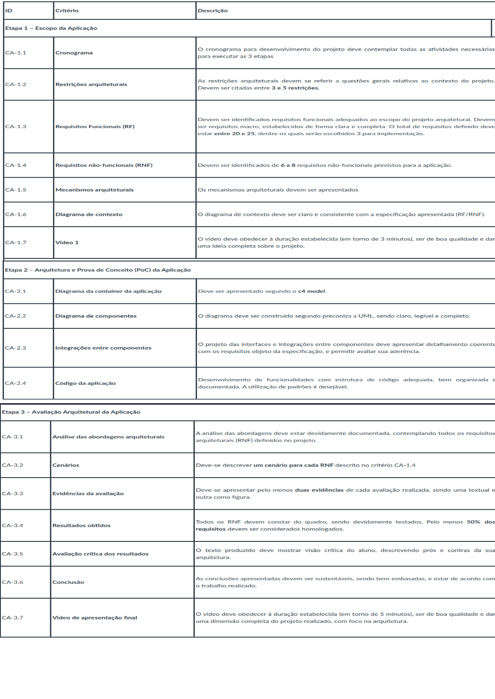

# Projeto Integrado – Arquitetura de Software Distribuído

"O problema a ser abordado no Projeto Integrado é escolhido pelo aluno e, dessa forma, espera-se que os conhecimentos possam ser aplicados em um projeto alinhado com os interesses do aluno. Ao mesmo tempo, espera-se que o aluno desenvolva um bom projeto, que lhe permita aprender fazendo."

### 1-  Regulamento do Projeto Integrado

O desenvolvimento do trabalho deve ser no formato de um Relatório Técnico, conforme template fornecido, descrevendo e documentando tecnicamente a modelagem total e a implantação parcial de uma aplicação, em contexto corporativo ou não.

#### 2. Escopo do Trabalho

O Projeto Integrado consiste na definição arquitetural visando ao desenvolvimento de uma aplicação, contemplando sua modelagem macroarquitetural e da especificação de partes do sistema escolhido, bem como a elaboração de outros artefatos relacionados à Arquitetura de Software.

#### 2.1 Etapa 1: Escopo da Aplicação

 O aluno deve escolher um contexto de negócio a partir do qual as atividades de seu projeto serão desenvolvidas. A partir dessa definição, o aluno deve contextualizar o projeto, descrevendo do que se trata o trabalho, em que área ou contexto se insere. Também deve detalhar o problema que o projeto pretende resolver e descrever a motivação para o projeto.

 Os tópicos que compõem a etapa 1 constam das seções 1, 2 e 3 do modelo fornecido (Template Relatório Tecnico ASD), e são os seguintes:

 - Seção 1 - Introdução;
 - Seção 2 - Cronograma;
 - Seção 3.1 – Restrições arquiteturais;
 - Seção 3.2 - Requisitos funcionais;
 - Seção 3.3 - Requisitos não-funcionais;
 - Seção 3.4 – Mecanismos arquiteturais;
 - Seção 4.1 – Diagrama de Contexto;
 - Produção do video 1, explicando e justificando o projeto.

#### 2.2 Etapa 2: Arquitetura e Prova de Conceito (PoC) da Aplicação

Os itens constantes da etapa 2, conforme modelo fornecido (Template Relatório Tecnico ASD), são:

- Seção 4.2 – Diagrama de Container;
- Seção 4.3 – Diagrama de Componentes;
- Seção 5.1 – Wireframe da POC;
- Seção 5.2 – Código da aplicação;

#### 2.3 Etapa 3: Avaliação Arquitetural da Aplicação

Os itens constantes da etapa 3, conforme modelo fornecido (Template Relatório Tecnico ASD), são:

- Seção 6.1 – Análise das abordagens arquiteturais;
- Seção 6.2 – Cenários;
- Seção 6.3 – Evidências da avaliação;
- Seção 6.4 – Resultados obtidos;
- Seção 7 – Avaliação crítica dos resultados;
- Seção 8 - Conclusão.
- Produção do video 2, apresentando o trabalho de forma completa.

## Etapas e Entregas

As três etapas descritas na seção anterior, que devem ser cumpridas sequencialmente, estão associadas, respectivamente, a três entregas distintas já configuradas no Ambiente Virtual de Aprendizagem (Canvas).

No decorrer do Projeto Integrado, o aluno escreverá um Relatório Técnico que irá incorporar os artefatos relacionados a cada etapa. No material da disciplina, pode ser encontrado um template desse Relatório Técnico. Observar que as etapas do relatório técnico estão relacionadas às entregas, como descrito na seção 2 deste documento.

### 3.1. Etapas e Artefatos

Em cada uma das entregas, previstas nas três etapas, deve ser encaminhado apenas um arquivo no formato PDF correspondente ao Relatório Técnico do projeto, parcial ou totalmente pronto (dependendo da etapa em que se encontra). Nesse documento são descritos todos os itens que compõem o trabalho. Para itens externos (como, por exemplo, ambientes hospedados na Internet, vídeos de apresentação, repositórios de código-fonte, entre outros), devem ser apresentados no referido documento os links para acesso.

Itens externos ao trabalho devem ser disponibilizados em repositórios públicos na Web e permanecer disponíveis durante o intervalo de tempo definido no cronograma da disciplina, para que possam ser avaliados pelos professores envolvidos no processo.

### Relatório Técnico:

#### Etapa 1 – Escopo da Aplicação

- Contextualização do trabalho descrevendo do que se trata o projeto, em que área ou contexto se insere; definição do problema que pretende resolver, descrevendo sua motivação;

- Cronograma das atividades do Projeto Integrado (não do sistema), contendo:
Atividades previstas para realização do trabalho;
Datas de início e término de cada atividade, de forma que o prazo total para o desenvolvimento do trabalho seja cumprido;

Observação: esse cronograma será seu guia para as atividades a serem desenvolvidas e será entregue atualizado ao final de cada etapa, juntamente com os outros artefatos solicitados.

- Restrições arquiteturais, contendo a descrição das restrições em relação ao escopo escolhido;
Requisitos Funcionais previstos para a sua aplicação, enumerados, descritos de forma resumida e priorizados. Se julgar necessário, separe os requisitos por módulos.

Obs: neste documento não é necessário fazer uma descrição completa e exaustiva de requisitos. Pode-se apenas descrever os requisitos de forma resumida, numerando-os para melhor identificação.

- Requisitos não-funcionais previstos para a sua aplicação, incluindo todos os que julgar importantes do ponto de vista arquitetural, ou seja, os que terão impacto na definição da proposta da solução;
Mecanismos arquiteturais: descrição dos mecanismos que permitem fazer a “ponte” entre a definição conceitual da solução (análise) e sua implementação, passando pela visão de desenho;
Diagrama de Contexto: apresentação do diagrama geral (macroarquitetura) da aplicação, conforme modelo C4. Trata-se de um desenho que não precisa ser aderente à Unified Modeling Language (UML), mas que deve permitir uma visão completa e clara dos componentes macros da arquitetura, suas funções e interfaces;

- Vídeo de apresentação.

#### Artefatos da Etapa 2 - Arquitetura e Prova de Conceito (PoC) da Aplicação

- Diagrama de Container: este é um diagrama que apresenta os repositórios (containers) e seus componentes. Pode ser entendido como um detalhamento do diagrama de contexto, não sendo também um diagrama preconizado pela UML;

- Diagrama de Componentes: dentre os diagramas produzidos no relatório este é o único que deve seguir o padrão da UML, necessitando portanto de um cuidado na sua elaboração. Tipicamente ele apresenta os componentes arquiteturais e suas relações, permitindo entender de forma completa a estrutura arquitetural proposta;

- Seção 5.1 – Wireframe da POC: apresentar o desenho das interfaces e de sua navegabilidade, de modo que a arquitetura possa ser implementada de maneira eficaz. Neste item apenas as três funcionalidades a serem implementadas (à escolha do aluno) devem ser apresentadas;

- Seção 5.2 – Código da aplicação: esta parte da descrição deve conter uma descrição da estrutura das classes da aplicação e um link para o repositório do código. É importante apresentar/descrever apenas o código gerado no seu trabalho.

#### Artefatos da Etapa 3 - Avaliação Arquitetural da Aplicação

- Análise das abordagens arquiteturais: esta seção permite estruturar a avaliação da aplicação, segundo o método ATAM;

- Seção 6.2 – Cenários: aqui serão estabelecidos os cenários submetidos a avaliação, segundo o método ATAM;

- Seção 6.3 – Evidências da avaliação: apresente evidências (textuais e/ou de imagens) que comprovem o atendimento da aplicação aos cenários submetidos a avaliação, segundo o método ATAM;

- Seção 6.4 – Resultados obtidos: apresente, num quadro, um resumo com os resultados que foram alcançados pelo projeto, em termos dos requisitos não-funcionais almejados.

- Seção 7 – Avaliação crítica dos resultados: escreva uma avaliação crítica, refletindo sobre o aprendizado, as dificuldades encontradas, prós e contras. É importante cotejar com os resultados almejados, visando verificar o que se conseguiu e o que não foi possível atingir, em termos de objetivos;

- Seção 8 – Conclusão: escreva uma conclusão de modo a encerrar o trabalho, porém deixando em aberto possibilidades para sua continuação futura.

## Processo de Avaliação e Pontuação das Entregas

### 4.1 - Processo de Avaliação e Pontuação das Entregas

Os pontos da disciplina são distribuídos da seguinte forma:

- Etapa 1 – 30 pontos;
- Etapa 2 – 30 pontos;
- Etapa 3 – 40 pontos.

Critérios de Aceitação

